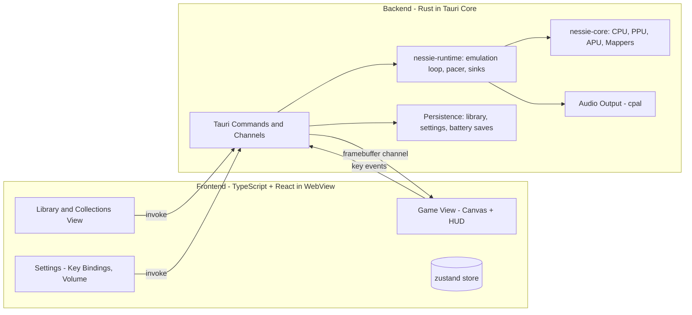
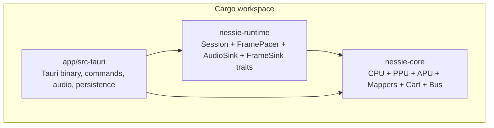
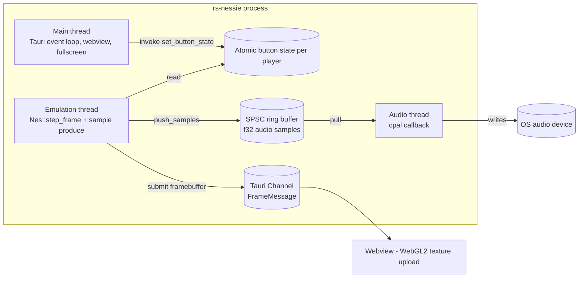
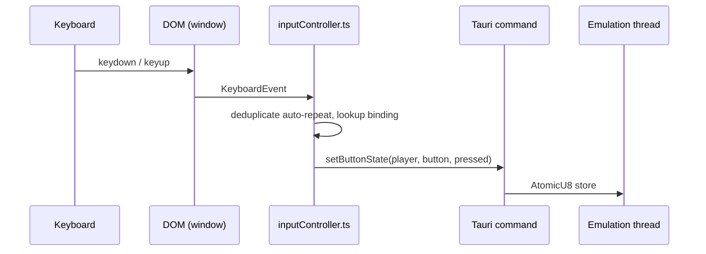

# Architecture

This document is derived from the technical specification (
[`./.zenflow/tasks/create-a-nes-8bit-emulator-which-2e40/spec.md`](../.zenflow/tasks/create-a-nes-8bit-emulator-which-2e40/spec.md))
sections §2 and §6. It is the canonical place to look when you need an overview
of how the components fit together.

## Component diagram



## Crate / module layout

The Rust workspace is split so that the emulator core can be developed, tested,
and benchmarked in isolation from the desktop shell.



- **`nessie-core`** is a leaf crate with **zero Tauri / cpal / webview
  dependencies**. It exposes the `Nes` facade, the `Mapper` trait, the iNES
  parser, and a `CoreError`. It is fully headless and unit-testable.
- **`nessie-runtime`** owns the engine-agnostic emulation loop. It depends on
  `nessie-core` and exposes traits (`AudioSink`, `FrameSink`, `Clock`) plus the
  `Session` lifecycle and `FramePacer`. It has no Tauri / cpal deps.
- **`app/src-tauri`** is the Tauri binary. It implements concrete `AudioSink`
  (cpal-backed) and `FrameSink` (Tauri `Channel<FrameMessage>`-backed) adapters,
  hosts the IPC commands (`./app/src-tauri/src/commands/`), and the persistence
  layer for the library / settings / battery saves.

The frontend ([`./app/src/`](../app/src/)) is plain React + TypeScript;
the IPC contract is mirrored by hand in
[`./app/src/ipc/types.ts`](../app/src/ipc/types.ts) and wrapped by typed
functions in [`./app/src/ipc/client.ts`](../app/src/ipc/client.ts).

## Threading model



Threads:

- **Main thread** — Tauri runs its event loop here. It receives IPC `invoke`
  calls from the webview and dispatches them to commands. Window operations
  (fullscreen toggle, resize) happen on this thread.
- **Emulation thread** — one per active session. Created via
  `std::thread::spawn` when `startSession` is invoked. It loops:
  1. Read latest button states from `Arc<AtomicU8>` per player.
  2. Call `Nes::step_frame()` (≈29,780.5 CPU cycles per NTSC frame).
  3. Drain audio samples into the SPSC ring buffer (`ringbuf` / `crossbeam`).
  4. Send the 256×240 RGBA framebuffer over the Tauri `Channel<FrameMessage>`.
  5. Sleep until the next deadline (audio-clock-paced; see "Frame pacing").
- **Audio thread** — owned by `cpal`. The OS calls back on this thread to pull
  samples. The callback reads from the SPSC ring buffer; if starved, it emits
  silence rather than blocking, so the audio device never stalls.

Synchronization:

- Button state per player is a single `AtomicU8` (8 bits = 8 NES buttons).
  Lock-free, no false-sharing, sub-µs writes from the main thread.
- Audio uses an SPSC ring buffer — single producer (emulation thread), single
  consumer (audio thread). Lock-free and bounded; on overrun, the oldest
  samples are dropped, not the newest, which keeps audio latency tight.
- Frame submission goes through Tauri's typed `Channel`, which is internally
  back-pressured by the webview. If the webview is slow, the channel queues a
  bounded number of frames and drops the oldest when full.

## Frame pacing

Video follows audio. The `FramePacer` in `nessie-runtime` reads the audio
sink's reported sample rate and the number of samples consumed since the last
frame, then computes a deadline for the next `step_frame()`. This way audio
glitches do not accumulate into permanent video drift, and conversely the
emulation can "catch up" after a brief stall without overshooting.

A `Clock` trait abstracts `Instant::now()` so the pacer is unit-testable with
a mocked clock and a synthetic sample-count source.

## Framebuffer pipeline

```mermaid
sequenceDiagram
  participant Emu as Emulation thread
  participant Chan as Tauri Channel
  participant FE as Frontend
  participant GL as WebGL2

  Emu->>Chan: submit(framebuffer: &[u8; 256*240*4], frame_idx)
  Chan->>FE: FrameMessage { frame, pixels: ArrayBuffer }
  FE->>GL: gl.texSubImage2D(target, 0, 0, 0, 256, 240, RGBA, UNSIGNED_BYTE, pixels)
  FE->>GL: gl.drawArrays(TRIANGLES, 0, 6)
```

Key properties:

- The framebuffer is a fixed 256×240 RGBA8 buffer (245,760 bytes / frame). At
  60 Hz NTSC the total bandwidth is ~14 MB/s — well within the typed
  `Channel`'s capacity on commodity hardware.
- The texture is allocated **once** at session start; per-frame uploads use
  `texSubImage2D` into the same texture. The unit quad VBO is also
  allocated once.
- A simple vertex/fragment shader pair draws the texture to the largest
  integer-multiple rectangle that preserves the chosen aspect ratio (default
  4:3 per FR-17, with 8:7 PAR available).
- Audio is **not** in this pipeline; cpal pulls directly from the SPSC ring
  buffer on the audio thread. Routing audio through IPC would add jitter for
  no benefit.

## Input pipeline



- Two players are supported by maintaining two `Map<KeyboardEvent.code,
  NesButton>` lookups, one per player. A single global listener serves both —
  the OS does not need to expose per-device routing.
- The controller debounces OS key auto-repeat by tracking pressed-state per
  code; only state transitions become IPC calls.
- IPC writes the appropriate bit in the player's `AtomicU8`. The emulation
  thread reads the atomic at the start of each frame.

## Persistence

All user data lives under the OS user-config directory (`dirs::config_dir()`
joined with the bundle identifier `dev.rs-nessie`). Three classes of files:

| File | Purpose | Schema owner |
|---|---|---|
| `library.json` | ROM entries (id, title, path, sha1, mapper, size) and collections (id, name, rom_ids) | [`./app/src-tauri/src/library.rs`](../app/src-tauri/src/library.rs) |
| `settings.json` | Per-player key bindings, volume, mute, window state | [`./app/src-tauri/src/settings.rs`](../app/src-tauri/src/settings.rs) |
| `saves/<sha1>.srm` | Raw battery-backed PRG-RAM per cartridge | `nessie-core` cartridge + `EmulatorSession` |

Writes are **atomic**: each save writes to a `.tmp` sibling and then `rename`s
into place, so a crash mid-write cannot corrupt the file. On load, the library
is defensively pruned of dangling references.

Battery saves are keyed by the ROM's SHA-1, not its path, so saves follow the
cartridge content even if the user moves the `.nes` file on disk.

## IPC contract

See [`./.zenflow/tasks/create-a-nes-8bit-emulator-which-2e40/spec.md`](../.zenflow/tasks/create-a-nes-8bit-emulator-which-2e40/spec.md)
§5 for the authoritative type definitions. The contract is implemented by:

- Rust commands in [`./app/src-tauri/src/commands/`](../app/src-tauri/src/commands/)
  (one file per logical group: `library.rs`, `rom.rs`, `emulator.rs`,
  `settings.rs`, `shell.rs`).
- Typed TypeScript wrappers in
  [`./app/src/ipc/client.ts`](../app/src/ipc/client.ts) and types in
  [`./app/src/ipc/types.ts`](../app/src/ipc/types.ts).
- A single `AppError` enum (`serde(tag = "code", content = "details")`) flowing
  the `Err` arm of every `Result<T, AppError>` — see
  [`./app/src-tauri/src/error.rs`](../app/src-tauri/src/error.rs).

`startSession` uniquely accepts a typed Tauri `Channel<FrameMessage>` and
stores it in the session; the runtime's `FrameSink` adapter forwards
`bytemuck::cast_slice`d framebuffers through it. Audio does not use IPC.

## Security posture

- Tauri CSP is locked down to `default-src 'self'; img-src 'self' data:;` —
  no remote origins and no script-src widening.
- No HTTP client dependency. The app works fully offline (NFR-7).
- File access goes through allowlisted commands only; the webview itself has
  no direct filesystem capability.

## Where to read more

- [Design decisions](./design-decisions.md) — *why* the architecture looks the
  way it does.
- [Development guide](./development.md) — how to build, run, and test.
- [Contributing](./contributing.md) — code review expectations and how to add
  a new mapper.
